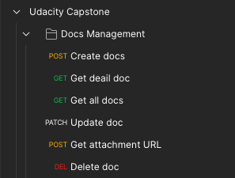
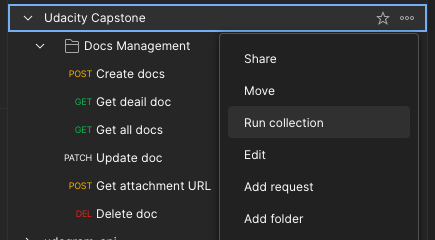
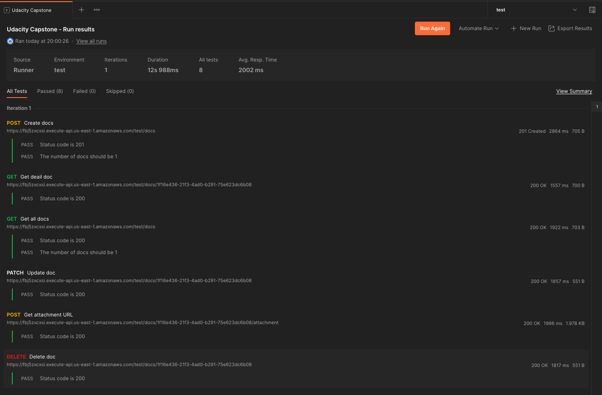
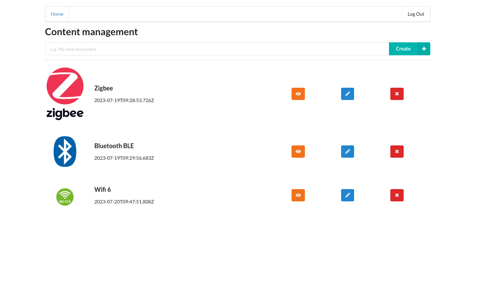

# Serverless Documentation management

## Functionality of the application

- An user need to authorize in order to access application.

- The application allows users to create/update/delete/view documentation item.

- The application allows users to upload attachment image file.

- The application only shows documentation for specific logged in user.

## Prerequisets

- [NodeJS](https://nodejs.org/en) version 16.x
- [Serverless Framework](https://www.serverless.com) version 3.x

## Backend API

To deploy the application, run the following commands:

```bash
cd api
npm install

# deploy application to dev environment
sls --deploy --verbose

# or deploy application to test environment, for purpose to test with postman collection
sls --deploy --verbose --stage test
```

## Frontend UI

```bash
cd ui
npm install
# start application in dev environment
npm run start

# or start application in test environment
REACT_APP_ENV=test npm run start
```

## Postman Collection

An alternative way to test the API is using the Postman collection. Postman collection also be included in this repo named `Udacity Capstone.postman_collection.json`

After imported Postman collection, you should see this:



Update variables in collection then run the collection:



The result should be look like the following:



## Screenshots


